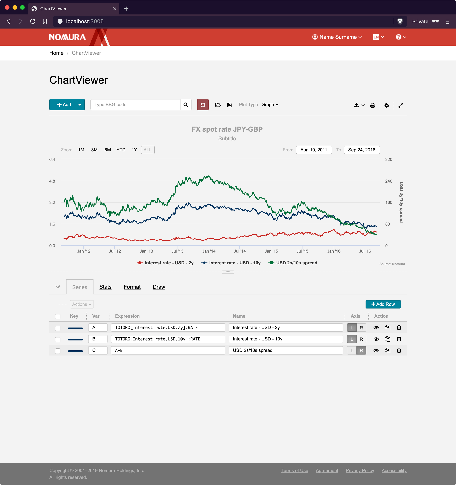

# Nomura® ChartViewer HTML Prototype

The HTML prototype has been created for Nomura Securities to—

- improve overall user experience;
- migrate from Flex to HTML5 technology stack;
- test how Nomura’s revamped user interface would work with [Highcharts](https://www.highcharts.com/) and [SlickGrid](https://github.com/mleibman/SlickGrid) components.

## Components

1. HTML5
1. CSS3/[SASS](https://sass-lang.com/)
1. [jQuery 3.4.1](https://jquery.com/)
1. [Bootstrap 3.4](https://getbootstrap.com/docs/3.4/)
1. [HighCharts](https://www.highcharts.com/)
1. [SlickGrid](https://github.com/mleibman/SlickGrid)
1. [jsTree](https://www.jstree.com/)
1. [Split.js](https://split.js.org/)
1. [FontAwesome 4](https://fontawesome.com/v4.7.0/)
1. [i18next](https://www.i18next.com/)

## Dev Tools

1. [Nodemon](https://nodemon.io/)
1. [Webpack](https://webpack.js.org/) with [Webpack Dev Server](https://webpack.js.org/configuration/dev-server/)
1. [ExpressJS](https://expressjs.com/)
